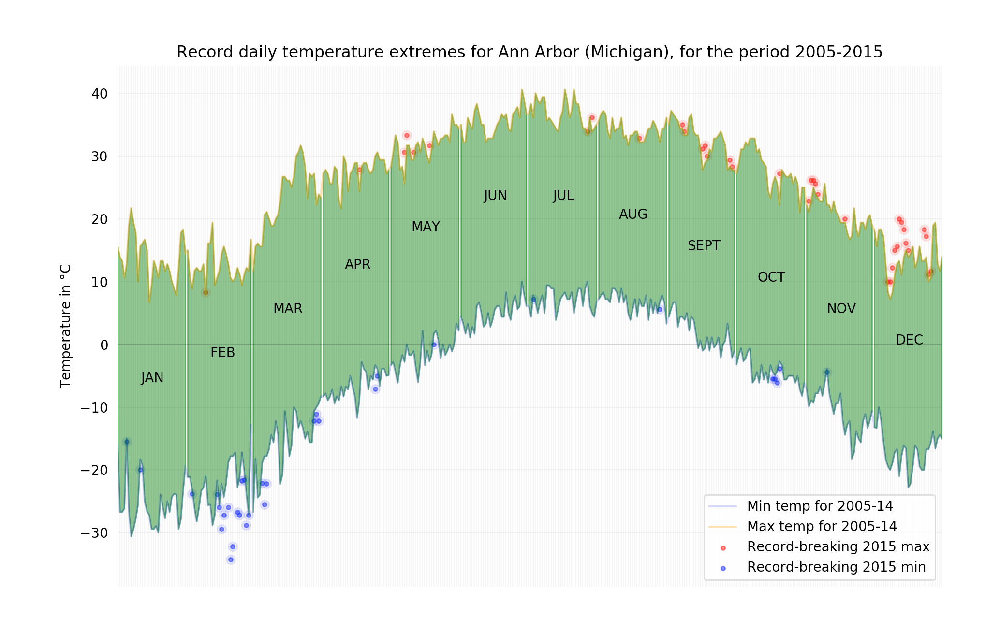
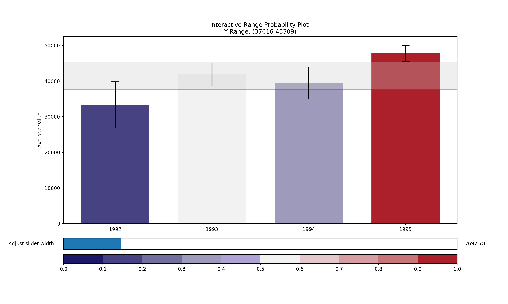

# Data Science with Python

* A collection of iPython notebooks about using Python libraries for Data Science.
* Libraries:
  1. Data Manipulation ([Pandas](http://pandas.pydata.org/) and [numpy](http://www.numpy.org) libraries)
  2. Visualization ([matplotlib](https://matplotlib.org/) library)
  3. Machine Learning ([sklearn/scikit-learn](http://scikit-learn.org/) library)

### Sample visualizations (visualized using Matplotlib and Seaborn)
* Plot of temperature extremes for Ann Arbor (Michigan)  

* Interactive range probability plot

